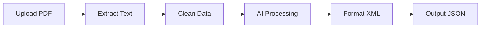

# 📄 Invoice PDF to JSON Converter (n8n Workflow)

Automated invoice processing workflow for **n8n**
Extract structured invoice data from PDF files using **AI-powered parsing with Google Gemini**.

---

## 📋 Table of Contents

* Overview
* Features
* Architecture
* Prerequisites
* Installation
* Configuration
* Usage
* Output Schema
* Customization
* Troubleshooting
* FAQ
* Contributing
* Resources
* License

---

# 🎯 Overview

This workflow automates the extraction of structured invoice data from PDF documents.

Users upload an invoice PDF through a web form, and the workflow returns clean, structured **JSON output**, ready for:

* Accounting systems
* ERP integrations
* Databases
* Automation pipelines

---

## ✅ Workflow Process



---

## Perfect For

* Automated accounts payable
* Multi-vendor invoice processing
* ERP invoice extraction
* Financial reporting automation
* Document-to-data workflows

---

# ✨ Features

| Feature                   | Description                              |
| ------------------------- | ---------------------------------------- |
| 🌐 Web Form Upload        | Upload invoices via a public form        |
| 📑 PDF Text Extraction    | Extracts text from standard PDFs         |
| 🤖 AI Parsing (Gemini)    | Converts raw text into structured fields |
| 🎯 Structured Output      | Produces JSON using predefined schema    |
| 🔧 Customizable Schema    | Adapt to any invoice format              |
| ⚡ Fast Processing         | Typical runtime: 3–5 seconds             |
| 🌍 Multi-language Support | Prompt language can be changed           |

---

# 🏗️ Architecture

## Workflow Nodes

| Step | Node Name               | Type            | Purpose                        |
| ---- | ----------------------- | --------------- | ------------------------------ |
| 1️⃣  | On Form Submission      | formTrigger     | Receives PDF upload            |
| 2️⃣  | Extract From File       | extractFromFile | Extracts PDF text              |
| 3️⃣  | Clean Data + XML Schema | set             | Prepares structured schema     |
| 4️⃣  | Message a Model         | googleGemini    | AI transforms text → XML       |
| 5️⃣  | Clean XML Output        | set             | Removes artifacts + formatting |
| 6️⃣  | XML to JSON             | xml             | Converts XML → JSON            |

---

## Data Flow

```
PDF Invoice
   ↓
Raw Extracted Text
   ↓
Clean Text + XML Schema
   ↓
Gemini AI Processing
   ↓
Structured XML
   ↓
Final JSON Output ✅
```

---

# 📦 Prerequisites

Before starting, ensure you have:

* ✅ n8n instance (v1.0+ recommended)
* ✅ Google Gemini API key
* ✅ Basic n8n workflow knowledge

---

## API Notes

* Free tier: ~60 requests/minute
* Estimated cost: $0.01–$0.05 per invoice

---

# 🚀 Installation

## Step 1: Import Workflow

1. Open your n8n instance
2. Go to **Workflows → Import**
3. Paste workflow JSON
4. Click **Import**

---

## Step 2: Configure Gemini Credentials

1. Go to **Credentials**
2. Click **Add Credential**
3. Select **Google Gemini API**
4. Enter:

```text
API Key: [Your Google AI Studio Key]
```

5. Save

---

## Step 3: Connect Credential

1. Open workflow
2. Click **Message a Model** node
3. Select Gemini credential
4. Save

---

## Step 4: Activate Workflow

Toggle workflow to **Active** (top-right).
Your form is now live.

---

# ⚙️ Configuration

---

## Node 1: Form Trigger

Creates a public upload form.

```text
Form Title: Invoice Upload
Field Name: data
Type: File
Accept: .pdf
```

### Form URL

Open the trigger node and copy:

```
https://your-n8n.app/form/xyz123
```

---

## Node 2: Extract From File

```text
Operation: PDF
Output: Extracted text content
```

⚠️ Works only with **text-based PDFs**.
Scanned invoices require OCR preprocessing.

---

## Node 3: Data Preparation

### Clean Text Variable

```javascript
={{ $json.text.replace(/\n/g, ' ') }}
```

### XML Schema Definition

```xml
<invoice>
  <invoice_number>[invoice_number]</invoice_number>
  <date_of_issue>[date_of_issue]</date_of_issue>

  <billed_to>
    <company_name>[billed_to.company_name]</company_name>
  </billed_to>

  <from>
    <company_name>[from.company_name]</company_name>
  </from>

  <items>
    <item>
      <description>[item.description]</description>
      <unit_cost>[item.unit_cost]</unit_cost>
    </item>
  </items>

  <financials>
    <subtotal>[subtotal]</subtotal>
    <invoice_total>[invoice_total]</invoice_total>
  </financials>
</invoice>
```

---

# 🤖 Node 4: AI Processing (Google Gemini)

Converts invoice text into structured XML.

### Default Prompt (English)

```text
Rewrite this invoice as XML using this schema:

{{ $json.estructuraXML }}

Invoice Text:
{{ $json.text_limpio }}
```

---

## Model Options

| Model            | Speed  | Accuracy  | Best For         |
| ---------------- | ------ | --------- | ---------------- |
| gemma-3n-e4b-it  | Fast   | Good      | Simple invoices  |
| gemini-pro       | Medium | Excellent | Complex invoices |
| gemini-1.5-flash | Fast   | Very Good | Balanced         |

---

# 🧹 Node 5: XML Cleanup

```javascript
={{ $json.content.parts[0].text
  .replace('```xml','')
  .replace('```','')
  .replace(/(\n|\s{2,})/g,'')
}}
```

---

# 🔄 Node 6: XML → JSON

Final structured conversion.

```text
Input Property: factura_limpia
normalize: false
trim: false
```

---

# 📤 Usage

1. Open form URL
2. Upload invoice PDF
3. Workflow runs automatically
4. JSON output appears in final node
5. Export or send downstream

---

# 📊 Output Schema Example

```json
{
  "invoice": {
    "invoice_number": "INV-001234",
    "date_of_issue": "2026-01-15",
    "billed_to": {
      "company_name": "Acme Corp"
    },
    "financials": {
      "subtotal": "50000.00",
      "invoice_total": "59000.00"
    }
  }
}
```

---

# 🎨 Customization

## Multiple Line Items Support

```xml
<items>
  <item>...</item>
  <item>...</item>
</items>
```

Add prompt instruction:

```text
If multiple items exist, generate multiple <item> blocks.
```

---

## Validation Code Node

```javascript
const invoice = $input.first().json.invoice;

if (!invoice.invoice_number) {
  throw new Error("Missing invoice number");
}
```

---

# 🔧 Troubleshooting

## PDF Text Extraction Empty

✔ Works: text-based PDFs
❌ Needs OCR: scanned invoices

Solution: Add OCR node (Tesseract or Vision API)

---

## AI Output Incorrect

Fix by adding strict prompt rule:

```text
Extract only what exists in the invoice.
Leave missing fields empty.
Do not invent values.
```

---

## XML Parsing Error

Ensure tags are closed and special characters escaped.

---

# ❓ FAQ

### Can it handle multi-page invoices?

Yes, but long invoices may need higher timeout.

### Does it support other languages?

Yes — translate the prompt in Node 4.

### Can it process scanned invoices?

Yes, with OCR preprocessing.

---

# 🤝 Contributing

1. Fork repository
2. Create feature branch
3. Commit changes
4. Submit pull request

---

# 📚 Resources

* n8n Documentation
* Google Gemini API Docs
* n8n Community Forum

---

# 📝 License

Released under the **MIT License**.

---

# ⭐ Support

Need help?

* Community Forum
* GitHub Issues
* Email Support

---

<div align="center">

⭐ If this workflow helped you, star the repo! ⭐
Made with ❤️ by **[Your Name]**

</div>